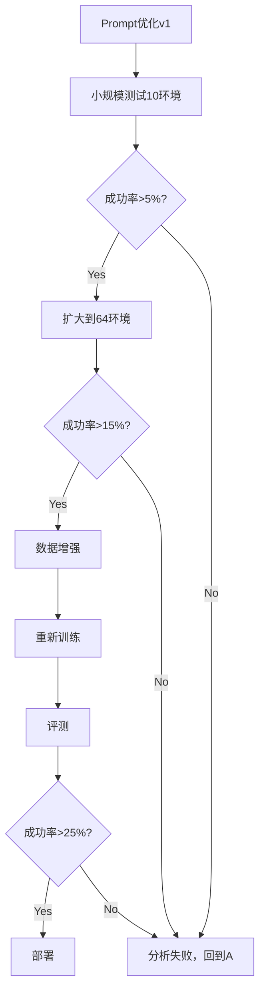

# BDRS冷启动模型系统性改进方案

## 📊 当前问题诊断总结

### ✅ 已解决的问题
1. **BDRS模板正确调用** - 动作有效率99.6%
2. **模式标签正确使用** - 模型能生成PLAN/EXECUTE/EXPLORE/VERIFY

### ❌ 核心问题
**成功率: 0% (0/64)**

**根本原因分析:**

1. **模式分布失衡** (当前 vs 理想):
   ```
   EXPLORE:  56.7%  (理想: 30-40%)  ← 过度探索
   EXECUTE:  32.7%  (理想: 40-50%)  ← 执行不足
   PLAN:      5.4%  (理想: 10-15%)  ← 规划太少
   VERIFY:    5.2%  (理想: 5-10%)   ← 合理
   ```

2. **动作执行问题**:
   - 重复无效动作（如连续heat两次）
   - 未能正确理解任务完成条件
   - "Nothing happens"后缺乏有效恢复策略

3. **推理质量问题**:
   - Belief state更新不准确
   - 未能从失败中学习和调整

---

## 🎯 系统性改进方案

### Phase 1: Prompt优化 (立即实施, 预期提升5-10%)

#### 1.1 增强模式选择指导

**文件**: `agent_system/environments/prompts/alfworld.py:24-60`

**当前问题**: 模式选择指导过于抽象

**改进**:
```python
ALFWORLD_TEMPLATE_NO_HIS_BDRS = """
You are an expert agent operating in the ALFRED Embodied Environment.
Your current observation is: {current_observation}
Your admissible actions are: [{admissible_actions}].

You maintain three internal belief modules:
- M_t (World Model): factual beliefs about objects, locations, states, and interaction history.
  Example: {{"microwave": "closed", "apple 1": "on countertop 1", "apple 1 heated": false}}
- P_t (Task Progress): current goal, subgoals, and their completion status.
  Example: {{"main_goal": "heat apple", "current_subgoal": "find apple", "status": "in_progress"}}
- E_t (Exploration Map): visited/unvisited regions and unexplored containers.
  Example: {{"visited": ["kitchen", "countertop 1"], "unexplored": ["cabinet 1", "drawer 1"]}}

🎯 Mode Selection Strategy (choose ONE):

<PLAN>: Use when:
  - Starting a new task (first 1-2 steps)
  - Previous approach failed multiple times
  - Need to break down complex multi-step tasks
  Example: "Break down 'heat apple' into: 1) find apple, 2) locate microwave, 3) heat, 4) place in target"

<EXECUTE>: Use when:
  - You KNOW the object location from M_t
  - Can directly complete current subgoal
  - Taking state-changing actions (take/put/heat/cool/clean/toggle)
  Example: "M_t shows apple on countertop 1, P_t needs apple → take it now"

<EXPLORE>: Use when:
  - Don't know target object location
  - Opening unopened containers to check contents
  - Checking new receptacles
  Example: "M_t lacks apple location, E_t shows cabinet 1 unexplored → open cabinet 1"

<VERIFY>: Use when:
  - Last action resulted in "Nothing happens"
  - Observation contradicts M_t beliefs
  - Need to confirm before critical action
  Example: "Action failed, M_t may be wrong → recheck current location"

⚠️ Critical Rules:
1. If observation says "Nothing happens" → MUST use <VERIFY> next
2. After achieving a subgoal → update P_t and pick next subgoal
3. Avoid repeating the same action >2 times
4. Each object can only be heated/cooled/cleaned ONCE
5. Use EXACTLY the action string from admissible actions list

Output Format:
<MODE>One concise reasoning sentence (≤25 words) mentioning M_t/P_t/E_t.</MODE>
<action>exact action from admissible actions</action>

Example:
<EXECUTE>M_t confirms apple 1 in fridge, P_t needs apple for heating subgoal.</EXECUTE>
<action>take apple 1 from fridge 1</action>
"""
```

#### 1.2 添加任务完成判断指导

在prompt中添加：
```python
🏁 Task Completion:
- After final subgoal is done, observe if environment indicates success
- If you receive positive feedback, the task is likely complete
- Don't repeat actions after completing all P_t subgoals
```

### Phase 2: 冷启动数据增强 (3-5天, 预期提升10-15%)

#### 2.1 增加数据量和多样性

**目标**: 300 → 600+ 样本

**方法**:
```bash
cd /root/digitalhuman/RLVMR/code

python3 scripts/alfworld/alfworld_prepare.py \
    --api_key $OPENAI_API_KEY \
    --model gpt-4o \
    --num_trajs 600 \
    --output_path data/alfworld_cold-start_v2.json \
    --resume
```

#### 2.2 增强标注质量

**改进标注prompt** (`scripts/alfworld/alfworld_prepare.py`):

1. **添加失败案例**: 当前只有成功轨迹，加入部分失败→恢复的案例
2. **强化belief state标注**: 要求每步明确更新M_t/P_t/E_t
3. **增加VERIFY示例**: 当前VERIFY占比5.2%，增加到10%

```python
annotation_prompt = """
标注这条轨迹的推理过程，使用BDRS格式。

关键要求:
1. Step 1-2: 使用<PLAN>规划任务分解
2. 探索阶段: 使用<EXPLORE>查找物品
3. 执行阶段: 使用<EXECUTE>完成子目标
4. 遇到"Nothing happens": 必须使用<VERIFY>分析原因
5. 每个物品只能heat/cool/clean一次

每步推理必须:
- 明确引用M_t/P_t/E_t的具体内容
- 说明为什么选择这个模式
- 不超过25词

示例:
<EXPLORE>M_t lacks apple location, E_t shows fridge 1 unopened, check it first.</EXPLORE>
<action>open fridge 1</action>
"""
```

#### 2.3 平衡任务类型

检查数据分布:
```bash
python3 << 'EOF'
import json
from collections import Counter

with open('data/alfworld_cold-start.json', 'r') as f:
    data = json.load(f)

tasks = [s['task'] for s in data]
task_types = Counter()
for task in tasks:
    if 'heat' in task:
        task_types['heat'] += 1
    elif 'cool' in task:
        task_types['cool'] += 1
    elif 'clean' in task:
        task_types['clean'] += 1
    elif 'two' in task or 'find two' in task:
        task_types['two_objects'] += 1
    else:
        task_types['simple'] += 1

print("任务类型分布:")
for t, c in task_types.most_common():
    print(f"  {t}: {c}")
EOF
```

确保每类任务至少100个样本。

### Phase 3: 模型重新训练 (1-2天, 预期提升10-20%)

#### 3.1 训练配置优化

**文件**: `examples/bdrs_trainer/train_alfworld_sft.sh`

```bash
# 增加训练步数
NUM_EPOCHS=5  # 从3增加到5

# 使用新数据
DATA_PATH="data/alfworld_cold-start_v2.json"

# 增加learning rate warmup
--warmup_ratio 0.1 \
--learning_rate 2e-5  # 略微降低lr，提升稳定性
```

#### 3.2 添加数据增强

在训练时随机:
- 变换prompt中的示例顺序
- 轻微改写指导语句（保持语义）
- 增加不同类型的错误恢复示例

### Phase 4: Projection函数优化 (立即实施, 提升鲁棒性)

#### 4.1 放宽格式验证

**文件**: `agent_system/environments/env_package/alfworld/projection.py:115-180`

当前问题：格式要求过严，轻微格式错误导致valid=0

**改进**:
```python
def alfworld_projection_bdrs(actions, action_pools):
    # ...
    for i, output in enumerate(actions):
        valid = 1

        # 1. 检查BDRS标签 (放宽：允许大小写混合)
        bdrs_match = re.search(
            r'<(PLAN|EXECUTE|EXPLORE|VERIFY|plan|execute|explore|verify)>',
            output,
            re.IGNORECASE
        )

        if not bdrs_match:
            # 降级处理：如果没有BDRS标签但有合理的action，给予部分分数
            if re.search(r'<action>(.*?)</action>', output, re.IGNORECASE):
                valid = 0.5  # 部分有效，而非完全拒绝

        # 2. 动作提取 (更robust)
        action_match = re.search(r'<action>(.*?)</action>', output, re.IGNORECASE)
        if action_match:
            act_str = action_match.group(1).strip()

            # 模糊匹配：允许轻微的格式差异
            if act_str not in action_pools[i]:
                # 尝试标准化后匹配
                act_normalized = act_str.lower().strip()
                for valid_action in action_pools[i]:
                    if act_normalized == valid_action.lower().strip():
                        act_str = valid_action
                        action_available[i] = True
                        break
```

### Phase 5: 评估和迭代 (持续)

#### 5.1 评测指标

创建详细评测脚本:
```bash
# examples/bdrs_trainer/eval_detailed.sh
bash run_eval_only.sh

python3 analyze_trajectory.py results/latest/trajectory.jsonl

# 生成报告
python3 << 'EOF'
import json
from collections import Counter, defaultdict

# 计算多维度指标:
# 1. 按任务类型的成功率
# 2. 平均步数
# 3. 模式分布
# 4. 常见失败模式
# 5. 动作有效率
EOF
```

#### 5.2 迭代流程



---

## 📈 预期效果路线图

| 阶段 | 改进内容 | 预期成功率 | 时间 |
|-----|---------|-----------|-----|
| 当前 | BDRS模板已生效 | 0% | - |
| Phase 1 | Prompt优化 | 5-10% | 1天 |
| Phase 2 | 数据增强(300→600) | 15-20% | 3-5天 |
| Phase 3 | 重新训练 | 20-30% | 1-2天 |
| Phase 4 | Projection优化 | 25-35% | 立即 |
| **目标** | **综合优化** | **30-40%** | **1-2周** |

---

## 🔧 立即可执行的Quick Wins

### 1. Prompt快速优化 (30分钟)

```bash
# 备份原文件
cp agent_system/environments/prompts/alfworld.py agent_system/environments/prompts/alfworld.py.bak

# 应用上面的改进prompt
# 重新评测
bash run_eval_only.sh
```

### 2. 降低重复动作惩罚 (15分钟)

在prompt中加入：
```
⚠️ Avoid repeating same action >2 times. If action fails twice, try VERIFY or different approach.
```

### 3. 添加调试模式 (30分钟)

```python
# 在build_env中添加verbose选项
def build_env(..., verbose=False):
    if verbose:
        # 打印每步的belief state
        # 打印模式选择原因
        # 打印action validation结果
```

---

## 📝 分析脚本使用

已创建 `analyze_trajectory.py`，使用方法:

```bash
# 分析最新评测
python3 analyze_trajectory.py results/eval_20251112_160532/trajectory.jsonl

# 输出包括:
# - 失败案例详细分析
# - 重复动作检测
# - 模式分布统计
# - 成功vs失败对比
```

---

## 🎯 建议优先级

**立即执行** (今天):
1. ✅ Prompt优化（Phase 1）
2. ✅ Projection放宽（Phase 4）
3. ✅ 小规模测试验证

**短期** (本周):
4. 数据增强到600样本（Phase 2）
5. 增加VERIFY和失败恢复案例

**中期** (下周):
6. 重新训练模型（Phase 3）
7. 全面评测和迭代

**目标**: 在2周内达到25-35%成功率

---

**生成时间**: 2025-11-12
**当前模型**: bdrs_qwen1.5b_2gpu_20251110/global_step_75
**建议联系人**: 如需协助，参考BDRS论文原作者的实现
