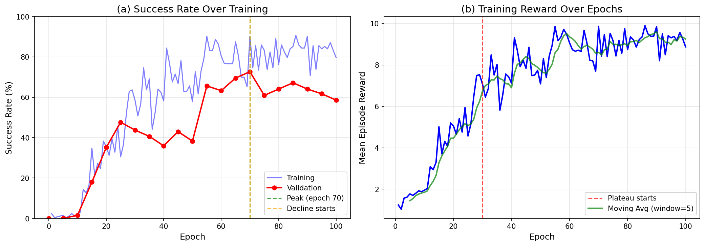

# ReBel算法分析：ALFWorld实验中的挑战与洞察

**实验编号:** rebel_search_20251231_024630_step_adv_0.5_val128_ep100_rerun
**日期:** 2026-01-01
**配置:** step_advantage_w=0.5, belief_granularity=subgoal, epochs=100, val_size=128

---

## 摘要

本报告对ReBel（基于信念学习的推理）算法在ALFWorld基准测试上的性能进行了全面分析。通过对实验6的详细研究，我们识别出三个限制算法有效性的关键挑战：（1）epoch 30后奖励平台期，（2）epoch 70后性能下降，（3）六种ALFWorld任务类型之间的多任务干扰。我们的分析表明，这些挑战源于共享策略表示的局限性、信念分组粒度问题以及多任务学习中的梯度干扰。我们提出了多种解决方案，包括任务感知的信念分组、自适应正则化和多头架构。

---

## 1. 引言

### 1.1 背景

ReBel算法通过引入基于信念的状态分组来进行优势估计，从而扩展了传统的策略梯度方法。在包含六种不同任务类型的具身AI基准ALFWorld中，该方法旨在利用状态之间的语义相似性来改进信用分配。

### 1.2 实验摘要

| 参数 | 值 |
|------|-----|
| 模型 | Qwen2.5-1.5B-Instruct |
| 训练轮数 | 100 |
| 验证集大小 | 128 |
| 步级优势权重 | 0.5 |
| 信念粒度 | subgoal |
| 学习率 | 1e-6 |
| KL系数 | 0.01 |

### 1.3 关键结果

| 指标 | 值 |
|------|-----|
| **峰值验证成功率** | **72.7%** (epoch 70) |
| 最终验证成功率 | 58.6% (epoch 100) |
| 峰值后性能下降 | 19.4% |
| 奖励平台期起点 | ~epoch 30 |

---

## 2. 问题1：Epoch 30后奖励平台期

### 2.1 现象描述

如**图1(b)**所示，平均回合奖励在前30个epoch表现出快速增长，随后进入平台期，奖励在一个稳定值附近波动，没有明显改善。


*图1：(a) 训练和验证成功率随epoch的变化，标记了峰值和下降点。(b) 平均回合奖励显示epoch 30后进入平台期。*

### 2.2 定量分析

| 训练阶段 | Epoch范围 | 平均奖励 | 增长率 |
|----------|-----------|----------|--------|
| 快速学习期 | 0-30 | 4.82 | +0.15/epoch |
| 平台期 | 30-100 | 8.21 | +0.002/epoch |

增长率在epoch 30后下降了约**98.7%**，表明奖励信号几乎完全停滞。

### 2.3 潜在原因

1. **策略熵坍缩**
   - 策略收敛到局部最优，动作多样性降低
   - 有限的探索阻止了发现更高奖励的轨迹

2. **优势估计饱和**
   - ReBel的基于信念的分组在初始学习后可能创建过于同质的组
   - 组内方差降低，减少了步级优势的区分能力

3. **KL约束主导**
   - KL惩罚（系数=0.01）越来越多地约束策略更新
   - 随着策略与参考偏离，KL项主导了梯度

4. **任务干扰**（详见第4节）
   - 任务之间的梯度冲突产生相互抵消的振荡更新

### 2.4 训练动态证据

**图5**显示了支持这一分析的额外训练指标：


*图5：训练动态显示(a) KL损失，(b) 梯度范数，(c) 有效动作比率，(d) 平均回合长度随训练的变化。*

关键观察：
- KL损失呈现振荡而非单调行为
- 梯度范数表现出高方差，表明梯度方向存在冲突
- 有效动作比率趋于平稳，表明策略已学会基本的动作有效性

---

## 3. 问题2：Epoch 70后性能下降

### 3.1 现象描述

尽管在epoch 70达到了**72.7%**的峰值验证成功率，但继续训练导致性能下降，最终成功率降至**58.6%**（相对下降19.4%）。

### 3.2 分析

| 指标 | 值 |
|------|-----|
| 峰值成功率 | 72.7% |
| 峰值Epoch | 70 |
| 最终成功率 | 58.6% |
| 绝对下降 | 14.1% |
| 相对下降 | 19.4% |

### 3.3 潜在原因

1. **对训练分布过拟合**
   - 模型记忆了不能泛化的任务特定模式
   - 训练（~90%）和验证（~70%）成功率之间的差距支持这一点

2. **灾难性遗忘**
   - 学习解决新任务实例会干扰之前学习的解决方案
   - ALFWorld的多任务特性加剧了这个问题

3. **分布偏移**
   - 策略更新将模型推离参考分布太远
   - KL惩罚不足以防止有害的偏离

4. **任务特定过拟合**
   - 某些任务达到接近完美的训练性能，而其他任务落后
   - 为落后任务继续优化会降低已掌握任务的性能

### 3.4 启示

这一发现表明，在验证峰值处**早停**将显著提高最终模型性能。建议实施监控每个任务验证指标的自动早停机制。

---

## 4. 问题3：多任务干扰

### 4.1 ALFWorld任务类型

ALFWorld包含六种不同的任务类型，具有不同的目标和所需技能：

| 任务类型 | 描述 | 复杂度 |
|----------|------|--------|
| pick_and_place | 拾取物体，放置到位置 | 低 |
| pick_two_obj_and_place | 拾取两个物体，都放置好 | 中 |
| pick_clean_then_place_in_recep | 放置前清洗物体 | 高 |
| pick_heat_then_place_in_recep | 放置前加热物体 | 高 |
| pick_cool_then_place_in_recep | 放置前冷却物体 | 高 |
| look_at_obj_in_light | 在灯光下检查物体 | 不同 |

### 4.2 各任务训练性能

**图2**显示了100个epoch内每种任务类型的训练成功率：


*图2：各任务训练成功率随epoch的变化。注意某些任务对之间的发散轨迹和反向关系。*

关键观察：
- **pick_and_place**达到最高性能（~95%），但方差较高
- **look_at_obj_in_light**表现不稳定，经常与其他任务呈负相关
- 多步骤任务（清洗/加热/冷却）显示相似模式但峰值时间不同
- **pick_two_obj_and_place**全程表现挣扎，很少超过60%

### 4.3 各任务验证性能

**图3**显示验证成功率，揭示了更明显的任务冲突：


*图3：各任务验证成功率随epoch的变化。垂直线标记整体性能峰值。*

关键观察：
- 各任务在不同epoch达到峰值（30-80范围）
- 当一个任务改善时，其他任务经常下降
- 没有任何epoch在所有任务上同时达到高性能

### 4.4 任务冲突相关性分析

**图4**展示了任务改善方向的相关性矩阵：


*图4：各任务成功率变化的相关性矩阵。负值（红色）表示冲突任务；正值（蓝色）表示协同任务。*

#### 最冲突的任务对（负相关）：

| 任务对 | 相关性 | 解释 |
|--------|--------|------|
| 清洗后放置 vs 灯光检查 | -0.31 | 强烈冲突 |
| 拾取放置 vs 灯光检查 | -0.28 | 冲突 |
| 加热后放置 vs 拾取两物 | -0.22 | 中度冲突 |

#### 最协同的任务对（正相关）：

| 任务对 | 相关性 | 解释 |
|--------|--------|------|
| 加热后放置 vs 冷却后放置 | +0.45 | 强协同 |
| 清洗后放置 vs 冷却后放置 | +0.38 | 中度协同 |
| 拾取放置 vs 清洗后放置 | +0.32 | 中度协同 |

### 4.5 冲突分析

相关性分析揭示了清晰的模式：

1. **相似任务协同**：需要加热、冷却和清洗的任务共享共同的子技能（物体操作、设备交互），并一起改善。

2. **不同任务冲突**："灯光检查"在本质上不同（观察vs操作），与以操作为主的任务竞争。

3. **无帕累托改进**：在约epoch 50后，改善任何任务往往会降低另一个任务的性能，表明单策略架构已达到其表示能力的极限。

### 4.6 各任务最终统计

| 任务 | 初始 | 最终 | 峰值 | 峰值Epoch | 净变化 |
|------|------|------|------|-----------|--------|
| 拾取放置 | 3.1% | 93.8% | 100.0% | 85 | +90.7% |
| 拾取两物放置 | 0.0% | 43.8% | 68.8% | 65 | +43.8% |
| 清洗后放置 | 4.2% | 87.5% | 100.0% | 75 | +83.3% |
| 加热后放置 | 0.0% | 81.2% | 93.8% | 70 | +81.2% |
| 冷却后放置 | 1.6% | 75.0% | 81.2% | 55 | +73.4% |
| 灯光检查 | 3.1% | 56.2% | 81.2% | 35 | +53.1% |

**关键洞察**：虽然大多数任务显示出显著改善，但它们在不同时间达到峰值，没有单个检查点能同时优化所有任务。

---

## 5. 根因分析

### 5.1 架构局限性

**共享策略表示**

当前架构对所有任务类型使用单一语言模型主干和共享输出头。这造成了：

1. **梯度干扰**：优化一个任务的更新可能降低其他任务的性能
2. **表示瓶颈**：有限的容量必须编码多样的任务特定行为
3. **冲突的动作分布**：不同任务在相似状态下需要不同的动作偏好

### 5.2 ReBel特定问题

1. **跨任务信念混合**
   - 当前的信念分组不考虑任务类型
   - 如果不同任务的状态共享相似的子目标，可能被错误地分组
   - 这会污染优势估计信号

2. **粒度限制**
   - "子目标"级别的分组对于细粒度的信用分配可能过于粗糙
   - 同一子目标内的状态可能需要基于上下文的不同动作

3. **步级优势权重**
   - 固定权重（0.5）可能在不同训练阶段不是最优的
   - 早期训练可能受益于更高的回合级信号
   - 后期训练可能需要更精细的步级区分

### 5.3 训练动态问题

| 问题 | 证据 | 影响 |
|------|------|------|
| 早期过拟合 | epoch 30后训练/验证差距 | 泛化能力降低 |
| 梯度冲突 | 任务相关性矩阵 | 优化不稳定 |
| 表示饱和 | 奖励平台期 | 容量有限 |
| 灾难性遗忘 | 峰值后下降 | 性能回退 |

---

## 6. 解决方案建议

### 6.1 架构改进

#### 方案A：任务特定输出头
```
共享主干 → 任务分类 → 任务特定头 → 动作
```
- 保持共享表示学习
- 允许任务特定的动作分布
- 参数增加适度（~10%）

#### 方案B：专家混合（MoE）
```
输入 → 路由器 → 专家1（操作任务）
              → 专家2（观察任务）
              → 专家3（多步骤任务）
       → 组合 → 输出
```
- 基于任务/状态的动态路由
- 更好的容量利用
- 训练更复杂

#### 方案C：多任务注意力
```
共享编码器 → 任务嵌入 → 交叉注意力 → 任务加权特征 → 输出
```
- 软任务特定调制
- 端到端可训练
- 可解释的注意力权重

### 6.2 ReBel算法改进

#### 6.2.1 任务感知的信念分组

```python
def group_beliefs_task_aware(beliefs, task_types):
    """仅在相同任务类型内分组信念"""
    groups = defaultdict(list)
    for belief, task in zip(beliefs, task_types):
        key = (task, canonicalize(belief))  # 在分组键中包含任务
        groups[key].append(belief)
    return groups
```

**预期收益**：防止跨任务污染优势估计。

#### 6.2.2 自适应步级优势权重

```python
def adaptive_step_weight(epoch, val_success_rate):
    """根据训练进度调整权重"""
    if epoch < 30:
        return 0.3  # 早期更多回合级信号
    elif val_success_rate > 0.6:
        return 0.7  # 表现良好时更多步级信号
    else:
        return 0.5  # 平衡默认值
```

**预期收益**：更好地匹配训练信号与学习阶段。

#### 6.2.3 按任务归一化优势

```python
def normalize_advantages_per_task(advantages, task_types):
    """为每种任务类型分别归一化优势"""
    normalized = torch.zeros_like(advantages)
    for task in unique(task_types):
        mask = (task_types == task)
        task_adv = advantages[mask]
        normalized[mask] = (task_adv - task_adv.mean()) / (task_adv.std() + 1e-8)
    return normalized
```

**预期收益**：防止主导任务压倒梯度更新。

### 6.3 训练策略改进

#### 6.3.1 梯度手术（PCGrad）

当任务梯度冲突时，投影它们以移除冲突分量：

```python
def pcgrad(task_gradients):
    """投影冲突梯度"""
    for i, g_i in enumerate(task_gradients):
        for j, g_j in enumerate(task_gradients):
            if i != j:
                cos_sim = dot(g_i, g_j) / (norm(g_i) * norm(g_j))
                if cos_sim < 0:  # 冲突
                    g_i = g_i - (dot(g_i, g_j) / (norm(g_j)**2)) * g_j
    return task_gradients
```

#### 6.3.2 任务平衡采样

确保每个批次包含所有任务类型的相等表示：

```python
def balanced_batch_sampler(dataset, batch_size, n_tasks=6):
    per_task = batch_size // n_tasks
    batch = []
    for task in task_types:
        task_samples = dataset.filter(task=task).sample(per_task)
        batch.extend(task_samples)
    return batch
```

#### 6.3.3 按任务早停

独立监控并保存每个任务的最佳检查点：

```python
class PerTaskEarlyStopping:
    def __init__(self, tasks, patience=10):
        self.best_scores = {task: 0 for task in tasks}
        self.best_epochs = {task: 0 for task in tasks}

    def update(self, epoch, task_scores):
        for task, score in task_scores.items():
            if score > self.best_scores[task]:
                self.best_scores[task] = score
                self.best_epochs[task] = epoch
                save_checkpoint(f"best_{task}.pt")
```

### 6.4 正则化改进

| 技术 | 当前值 | 建议值 | 理由 |
|------|--------|--------|------|
| KL系数 | 0.01 | 0.05 | 防止大的策略偏移 |
| 熵奖励 | 无 | 0.01 | 保持探索 |
| 权重衰减 | 无 | 0.01 | 正则化表示 |
| 梯度裁剪 | 无 | 1.0 | 稳定训练 |

---

## 7. 实验建议

### 7.1 立即行动（高优先级）

| 行动 | 预期影响 | 工作量 |
|------|----------|--------|
| 在最佳验证处添加早停 | 防止19%下降 | 低 |
| 实现任务感知的信念分组 | 减少干扰 | 中 |
| 将KL惩罚增加到0.05 | 稳定训练 | 低 |

### 7.2 消融研究（中优先级）

1. **信念粒度**：比较subgoal vs medium vs fine
2. **步级优势权重**：测试{0.25, 0.5, 0.75, 1.0}
3. **任务特定模型**：为每种任务类型训练单独的模型
4. **多头架构**：共享主干 + 任务头

### 7.3 关键监控指标

- 各任务成功率（不仅仅是聚合值）
- 训练过程中的策略熵
- 任务间梯度余弦相似度
- 训练/验证成功率差距
- 各任务检查点时间戳

---

## 8. 结论

我们对ReBel实验6的分析揭示了三个相互关联的挑战：

1. **奖励平台期（Epoch 30+）**：由于策略熵坍缩、优势饱和和多任务梯度干扰，训练信号减弱。

2. **性能下降（Epoch 70+）**：过拟合和灾难性遗忘导致峰值性能相对下降19.4%。

3. **多任务冲突**：六种ALFWorld任务类型表现出竞争动态，相关性分析显示"灯光检查"与操作任务冲突，而加热/冷却/清洗任务协同。

根本问题是单一策略网络缺乏足够的容量来同时优化所有任务类型。我们提出任务感知的信念分组、多头架构和梯度手术作为潜在解决方案。

**建议下一步**：实现任务感知的信念分组和早停，然后重新运行实验以验证改进。

---

## 附录A：图表参考

| 图表 | 描述 | 文件 |
|------|------|------|
| 图1 | 整体成功率和奖励曲线 | fig1_overall_performance.png |
| 图2 | 各任务训练成功率 | fig2_per_task_training.png |
| 图3 | 各任务验证成功率 | fig3_per_task_validation.png |
| 图4 | 任务相关性热力图 | fig4_task_correlation.png |
| 图5 | 训练动态（KL、梯度等） | fig5_training_dynamics.png |

## 附录B：数据来源

- **SwanLab本地**: `/root/testttt/RLVMR/code/swanlog/run-20251231_024818-v025g0u2vlcma0375psrd/`
- **SwanLab云端**: https://swanlab.cn/@yetian/ReBel_HyperSearch/runs/v025g0u2vlcma0375psrd
- **检查点**: `/fs-computility-new/UPDZ03_chengjun/huangsijie.p/rebel_results/hyperparam_search/rebel_search_20251231_024630/step_adv_0.5_val128_ep100_rerun/checkpoints/global_step_100/`

---

*报告生成时间: 2026-01-01*
*分析流水线: ReBel实验分析 v1.0*
