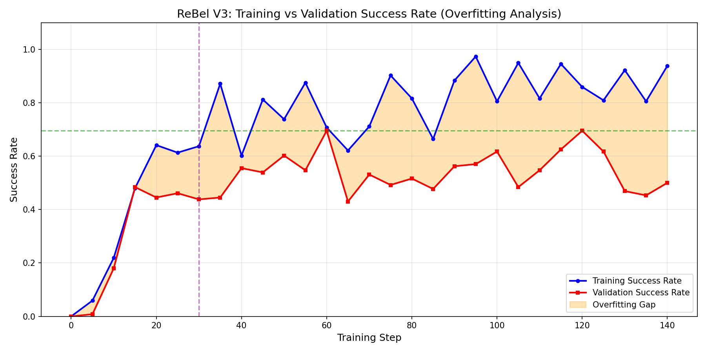
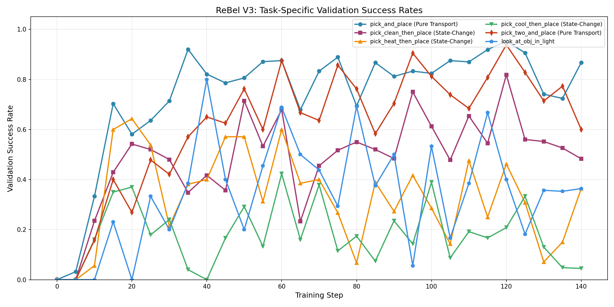
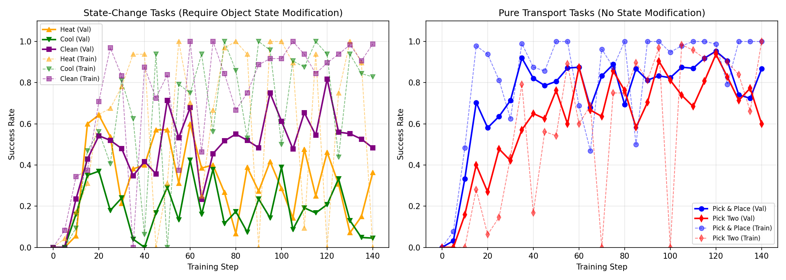
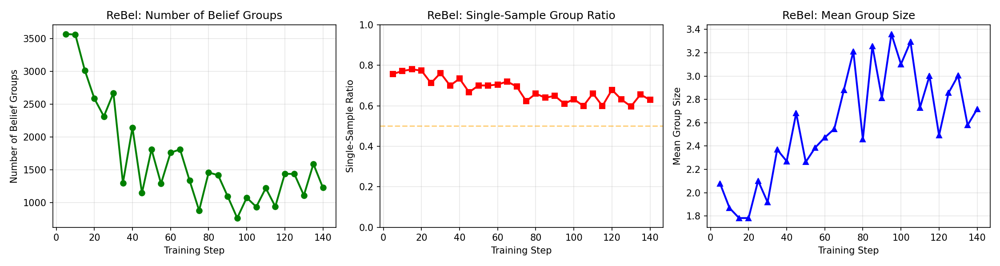
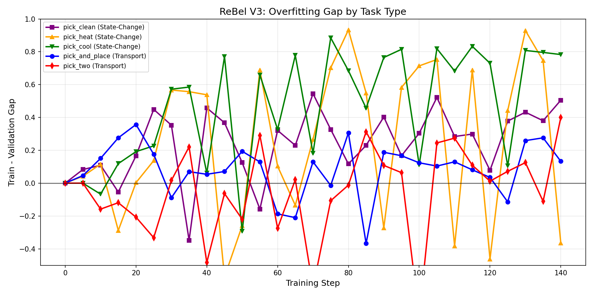

# ReBel V3 实验分析报告
## 8 GPU × 150 Epochs AlfWorld 训练

**日期**: 2026-01-04
**实验名称**: rebel_v3_8gpu_150ep_20260103_142940
**模型**: Qwen-1.5B + ReBel 强化学习训练

---

## 1. 摘要

### 核心发现

1. **Epoch 30 后出现严重过拟合**: 训练成功率持续攀升（达到 93.8%），而验证成功率在 55-70% 区间震荡，后期甚至出现下降。

2. **任务异质性问题**: "纯搬运类"任务与"状态改变类"任务在验证集上存在显著性能差距：
   - 纯搬运类 (pick_and_place, pick_two): 验证集 ~73%
   - 状态改变类 (heat, cool, clean): 验证集 ~30%
   - **差距: 43 个百分点**

3. **Belief Canonicalization 盲区**: 当前 `canonicalize_belief` 实现使用 `granularity='subgoal'`，完全忽略了物体状态属性，导致语义不同的状态产生哈希碰撞。

4. **单样本组比例过高**: 约 63-70% 的 belief 分组仅包含单个样本，限制了归一化的有效性。

---

## 2. 实验配置

```yaml
算法: ReBel
  belief_granularity: "subgoal"
  step_advantage_w: 0.5
  mode: "mean_norm"
  task_aware_grouping: false
  per_task_normalization: false

训练配置:
  GPU: 8 × A800-80GB
  Epochs: 150
  Batch Size: 16
  学习率: 1e-6
  KL Loss 系数: 0.01

环境: AlfWorld (generalization_level=0)
  max_steps: 30
  rollout.n: 16
  use_teacher_planner: true
  prompt_template_type: "explicit_task_type"
```

---

## 3. 训练动态分析

### 3.1 训练-验证差距演变

| Epoch | 训练成功率 | 验证成功率 | 差距 |
|-------|----------|--------|-----|
| 0     | 0.000    | 0.000  | +0.000 |
| 15    | 0.480    | 0.484  | -0.004 |
| **30**    | 0.637    | 0.438  | **+0.199** |
| 60    | 0.707    | **0.695**  | +0.012 |
| 90    | 0.883    | 0.562  | +0.321 |
| 120   | 0.859    | 0.695  | +0.164 |
| **140**   | **0.938**    | 0.500  | **+0.438** |

**观察结论**:
- 最佳验证性能: **69.5%**（Epoch 60/120）
- 最终 epoch 过拟合差距达 **43.8%**
- 验证性能波动剧烈（43.8% - 69.5%）

### 3.2 过拟合模式分析

```
训练阶段 1 (Epoch 0-15): 学习阶段
  - 训练和验证同步提升
  - 差距极小 (~0%)

训练阶段 2 (Epoch 15-30): 分化开始
  - 训练持续提升
  - 验证开始停滞
  - 差距达到 ~20%

训练阶段 3 (Epoch 30-150): 过拟合阶段
  - 训练达到 90%+
  - 验证在 45-70% 区间震荡
  - 差距可超过 40%
```

---

## 4. 任务异质性分析

### 4.1 任务类别细分

#### 纯搬运任务（无需状态修改）
| 任务 | 验证峰值 | 最终验证 | 最终训练 | 差距 |
|------|----------|-----------|-------------|-----|
| pick_and_place | 95.3% | 86.7% | 100% | +13.3% |
| pick_two_and_place | 93.8% | 60.0% | 100% | +40.0% |

#### 状态改变任务（需要修改物体状态）
| 任务 | 验证峰值 | 最终验证 | 最终训练 | 差距 |
|------|----------|-----------|-------------|-----|
| pick_heat_then_place | 64.3% | 36.4% | ~0% | **-36.4%** |
| pick_cool_then_place | 42.3% | 4.5% | 82.8% | **+78.3%** |
| pick_clean_then_place | 81.8% | 48.3% | 98.8% | **+50.5%** |

### 4.2 类别对比（最终 Epoch）

```
                         训练平均    验证平均    差距
状态改变类任务:           60.5%       29.7%     +30.8%
纯搬运类任务:            100.0%       73.4%     +26.6%
```

**关键洞察**: 状态改变类任务表现出更严重的过拟合和更低的验证性能。

---

## 5. 根因分析

### 5.1 Belief Canonicalization 盲区

**当前实现** (`core_rebel.py:29-53`):

```python
def canonicalize_belief(belief_state, granularity='subgoal'):
    if granularity == 'subgoal':
        # 只使用 subgoal + status - 完全忽略 state_changes!
        canonical = {
            'subgoal': task_progress.get('updated_subgoal', ''),
            'status': task_progress.get('subgoal_status', '')
        }
```

**问题场景**:

```
状态 1: Agent 拿着【生土豆】站在微波炉前
  - subgoal: "heat the potato"
  - status: "in_progress"
  - state_changes: {"potato": "raw"}

状态 2: Agent 拿着【熟土豆】站在微波炉前
  - subgoal: "heat the potato"
  - status: "in_progress"
  - state_changes: {"potato": "heated"}

结果: 两个状态生成了【完全相同】的 belief_hash!
```

**影响**:
- 状态改变任务需要区分物体状态（生 vs 熟、脏 vs 干净、常温 vs 冷却）
- 当前规范化将这些视为相同，导致：
  - 错误的优势归一化（将不兼容的状态分到同组）
  - 模型无法学习状态依赖的策略
  - 训练记忆特定轨迹而非学习可泛化策略

### 5.2 内在奖励权重失衡

**当前权重** (`core_rebel.py:758`):
```python
weights = {
    'consistency': 0.3,
    'progress': 0.5,
    'exploration': 0.2,
}
```

**问题**:
1. `progress_reward` 占主导（50%）但未能捕获状态变化
2. `consistency_reward`（30%）只检查位置正确性，不检查状态正确性
3. 缺少对达成正确物体状态的显式奖励

### 5.3 ReBel 分组统计

| 指标 | 数值 |
|--------|-------|
| 单样本组比例 | 63-70% |
| 平均组大小 | 2.1-3.2 |
| 组数量 | 877-3570 |

**问题**: 单样本组比例过高意味着大多数组无法从归一化中受益——它们的优势默认为 0。

---

## 6. 可视化总结

### 图 1: 训练 vs 验证差距


展示 Epoch 30 后的严重过拟合，差距超过 40%。

### 图 2: 各任务验证性能


展示状态改变类任务（heat, cool, clean）持续表现不佳。

### 图 3: 任务类别对比


对比状态改变类 vs 纯搬运类任务——性能差距明显。

### 图 4: ReBel 分组统计


展示高单样本比例限制了归一化效果。

### 图 5: 各任务过拟合差距


pick_cool 和 pick_clean 显示最大的过拟合差距（>70%）。

---

## 7. 改进方案

### 7.1 修复 Belief Canonicalization（关键）

**方案**: 创建 `granularity='state_aware'` 模式，包含物体状态：

```python
elif granularity == 'state_aware':
    task_progress = belief_state.get('task_progress_update', {}) or {}
    world_model = belief_state.get('world_model_update', {}) or {}

    # 关键: 包含 state_changes
    state_changes = world_model.get('state_changes', {})
    if not isinstance(state_changes, dict):
        state_changes = {}

    # 规范化状态描述符
    normalized_states = {}
    for obj, state in state_changes.items():
        state_lower = str(state).lower()
        # 映射到规范状态类别
        if any(x in state_lower for x in ['heated', 'hot', 'warm', 'cooked']):
            normalized_states[obj] = 'heated'
        elif any(x in state_lower for x in ['cooled', 'cold', 'cool', 'chilled']):
            normalized_states[obj] = 'cooled'
        elif any(x in state_lower for x in ['cleaned', 'clean', 'washed']):
            normalized_states[obj] = 'cleaned'
        else:
            normalized_states[obj] = state_lower

    canonical = {
        'subgoal': str(task_progress.get('updated_subgoal', '')).lower().strip(),
        'status': str(task_progress.get('subgoal_status', '')).lower().strip(),
        'object_states': sorted(normalized_states.items())
    }
```

**配置修改**:
```yaml
algorithm.rebel.belief_granularity: "state_aware"
```

### 7.2 添加状态改变奖励组件

**方案**: 在内在奖励中添加显式的 `state_change_reward`:

```python
def state_change_reward(belief, prev_belief, task_type):
    """奖励达成所需的状态改变"""
    if task_type not in ['pick_heat', 'pick_cool', 'pick_clean']:
        return 0.0

    world_model = belief.get('world_model_update', {}) or {}
    state_changes = world_model.get('state_changes', {}) or {}

    reward = 0.0
    for obj, state in state_changes.items():
        state_lower = str(state).lower()

        # 检查状态是否符合任务要求
        if task_type == 'pick_heat' and 'heated' in state_lower:
            reward += 0.3
        elif task_type == 'pick_cool' and 'cooled' in state_lower:
            reward += 0.3
        elif task_type == 'pick_clean' and 'cleaned' in state_lower:
            reward += 0.3

    return min(reward, 0.5)
```

**更新后的权重**:
```python
weights = {
    'consistency': 0.2,
    'progress': 0.3,
    'exploration': 0.2,
    'state_change': 0.3,  # 新增
}
```

### 7.3 启用任务感知分组

**方案**: 使用任务感知分组防止跨任务干扰：

```yaml
algorithm.rebel.task_aware_grouping: true
algorithm.rebel.per_task_normalization: true
```

这确保了：
- pick_heat 轨迹仅在 pick_heat 内归一化
- pick_cool 轨迹仅在 pick_cool 内归一化
- 防止主导任务（pick_and_place）压倒其他任务

### 7.4 早停/基于验证的检查点保存

**当前**: 每 50 个 epoch 保存
**方案**: 实现基于验证的检查点保存：

```python
if val_success_rate > best_val_success_rate:
    best_val_success_rate = val_success_rate
    save_checkpoint("best_val_model")
    patience_counter = 0
else:
    patience_counter += 1
    if patience_counter >= patience_limit:  # 例如 20 epochs
        # 考虑早停或降低学习率
```

### 7.5 减轻过拟合措施

1. **增加 KL 惩罚**: `kl_loss_coef: 0.01 → 0.05`
2. **Epoch 30 后降低学习率**: 实现学习率调度器
3. **在策略网络中添加 dropout**（如适用）
4. **增加验证频率**: `test_freq: 5 → 3`

---

## 8. 推荐的下一次实验配置

```yaml
algorithm:
  adv_estimator: rebel
  rebel:
    enable: True
    belief_granularity: "state_aware"  # 修改
    step_advantage_w: 0.3               # 降低
    mode: "mean_norm"
    task_aware_grouping: true           # 启用
    per_task_normalization: true        # 启用

# 内在奖励权重（代码中修改）
intrinsic_weights:
  consistency: 0.2
  progress: 0.3
  exploration: 0.2
  state_change: 0.3   # 新增

actor_rollout_ref:
  actor:
    kl_loss_coef: 0.03  # 增加
    lr: 5e-7            # 降低

trainer:
  test_freq: 3          # 更频繁
  save_freq: 20         # 基于验证保存最佳
```

---

## 9. 结论

ReBel V3 实验揭示了 belief canonicalization 策略中的关键缺陷，该缺陷导致状态改变类任务产生语义哈希碰撞。结合缺乏任务感知归一化，这导致了：

1. **严重过拟合**（43% 训练-验证差距）
2. **状态改变类任务泛化能力差**（验证 30% vs 搬运类 73%）
3. **belief 分组效果不佳**（70% 单样本组）

提出的改进聚焦于：
1. **状态感知的 belief 哈希**（最关键）
2. **任务感知的优势归一化**
3. **显式的状态改变奖励**
4. **过拟合缓解措施**

实施这些改进应能显著提升验证性能，特别是在状态改变类任务上。

---

*报告由自动化分析流程生成*
