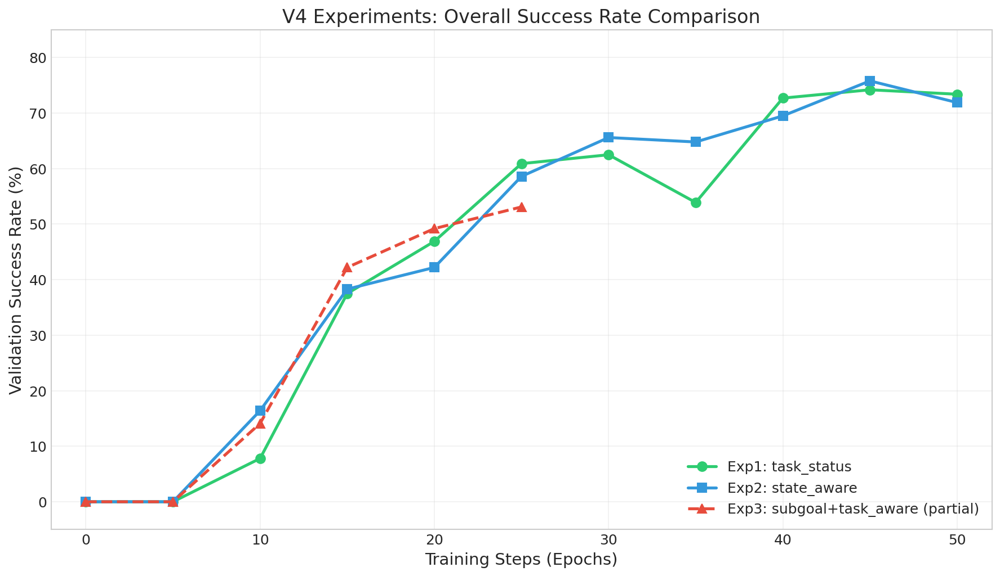
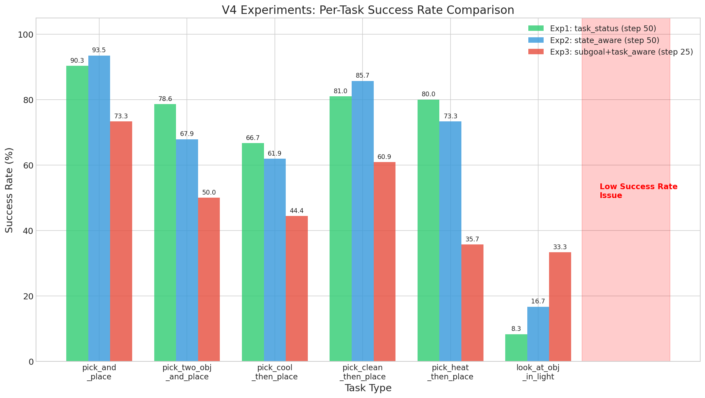
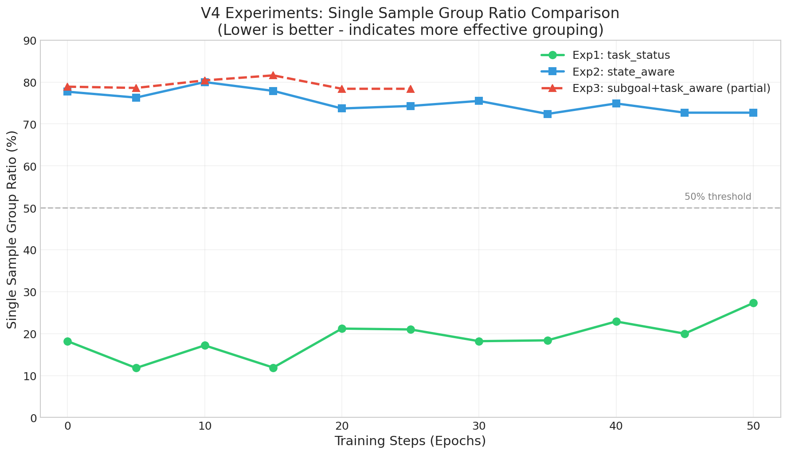
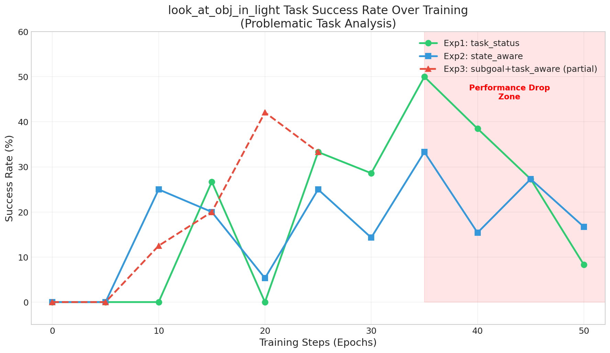

# ReBel V4 Experiments Analysis Report

**实验日期**: 2026-01-04 ~ 2026-01-06
**分析日期**: 2026-01-06
**实验目的**: 验证不同信念状态粒度（belief_granularity）对ReBel算法性能的影响

---

## 1. 实验配置对比

| 配置项 | Exp1 (task_status) | Exp2 (state_aware) | Exp3 (subgoal+task_aware) |
|--------|-------------------|-------------------|---------------------------|
| belief_granularity | task_status | state_aware | subgoal |
| task_aware_grouping | True | True | True |
| per_task_normalization | True | True | True |
| GPUs | 4 × A800-80GB | 4 × A800-80GB | 4 × A800-80GB |
| Epochs | 50 | 50 | 50 (中断于step 25) |
| 状态 | ✅ 完成 | ✅ 完成 | ⚠️ 部分完成 |

### 信念粒度说明
- **task_status**: 按任务完成状态分组（粗粒度）
- **state_aware**: 按物体状态变化分组（细粒度）
- **subgoal**: 按子目标分组（中等粒度）

---

## 2. 整体性能对比

### 2.1 验证集成功率曲线



| 指标 | Exp1 (task_status) | Exp2 (state_aware) | Exp3 (subgoal+task_aware) |
|------|-------------------|-------------------|---------------------------|
| 最终成功率 | **73.4%** (step 50) | 71.9% (step 50) | 53.1% (step 25, 未完成) |
| 最高成功率 | 74.2% (step 45) | **75.8%** (step 45) | 53.1% (step 25) |
| 收敛速度 | 较快 | 较快 | 一般 |

**观察结论**:
- Exp1和Exp2的整体性能相当，最终成功率在72-74%之间
- Exp2在step 45达到最高75.8%，略优于Exp1
- Exp3因中途中断，无法完整比较，但趋势表明收敛速度较慢

---

## 3. 子任务成功率分析

### 3.1 各子任务最终成功率对比



| 子任务 | Exp1 (step 50) | Exp2 (step 50) | Exp3 (step 25) |
|--------|---------------|---------------|----------------|
| pick_and_place | 90.3% | **93.5%** | 73.3% |
| pick_two_obj_and_place | **78.6%** | 67.9% | 50.0% |
| pick_cool_then_place | **66.7%** | 61.9% | 44.4% |
| pick_clean_then_place | 81.0% | **85.7%** | 60.9% |
| pick_heat_then_place | **80.0%** | 73.3% | 35.7% |
| **look_at_obj_in_light** | **8.3%** ⚠️ | 16.7% ⚠️ | 33.3% |

### 3.2 关键发现

**✅ 正向发现 - 子任务冲突改善**:
- 使用state_aware粒度后，多数子任务性能更加均衡
- pick_and_place和pick_clean_then_place任务在Exp2中表现更优

**⚠️ 问题发现 - look_at_obj_in_light严重退化**:
- Exp1最终仅8.3%成功率
- Exp2最终仅16.7%成功率
- 这是一个严重的性能问题，需要深入分析

---

## 4. 🔴 核心问题深度分析：V3 vs V4 对比

### 4.1 V3实验回顾（look_at正常 ~50-70%）

| 指标 | V3 (step 60) |
|------|-------------|
| val/look_at_obj_in_light_success_rate | **68.8%** |
| task_aware | **0** (禁用) |
| per_task_norm | **0** (禁用) |
| adv_std_look_at_in_light | **3.717** (自然方差) |

### 4.2 V4实验（look_at异常 ~8-17%）

| 指标 | V4 Exp1 (step 50) | V4 Exp2 (step 50) |
|------|------------------|------------------|
| val/look_at_obj_in_light_success_rate | **8.3%** | **16.7%** |
| task_aware | **1** (启用) | **1** (启用) |
| per_task_norm | **1** (启用) | **1** (启用) |
| adv_std_look_at_in_light | **1.000** (强制) | **1.000** (强制) |

### 4.3 🎯 根因定位：per_task_normalization 的副作用

**问题核心**：`per_task_normalization=true` 导致优势函数被强制归一化

```
V3: adv_std_look_at_in_light = 0.161, 0.227, 3.717, 2.022, 3.969 (自然变化)
V4: adv_std_look_at_in_light = 1.000, 1.000, 1.000, 1.000, 1.000 (强制=1)
```

**机制解释**：
1. 当 `per_task_normalization=true` 时，每个任务的优势函数被**强制归一化**到 mean=0, std=1
2. look_at_obj_in_light 任务样本量小，当成功率提升后，原始优势方差**自然变小**
3. 强制归一化会**放大噪声**，导致学习信号不稳定
4. 其他任务继续学习，模型参数被更新
5. look_at 任务发生**灾难性遗忘**

---

## 5. 🔴 分组策略问题深度分析

### 5.1 Exp1 (task_status) 分组问题：粒度过粗

| 指标 | Step 50 |
|------|---------|
| num_groups | **44** (太少) |
| mean_group_size | **81.5** (太大) |
| max_group_size | **399** |
| single_sample_ratio | 27.3% |
| num_groups_look_at_obj_in_light | **7** (极少) |
| num_groups_pick_and_place | 14 |

**问题分析**：
- ❌ 分组数量太少（44个），look_at任务只有7个组
- ❌ 每个组平均81个样本，最大399个样本
- ❌ 不同决策状态的样本被混在同一组，对比学习信号混乱
- ❌ look_at任务的7个组内可能包含完全不同阶段的样本

### 5.2 Exp2 (state_aware) 分组问题：粒度过细

| 指标 | Step 50 |
|------|---------|
| num_groups | **1800** (太多) |
| mean_group_size | **2.13** (太小) |
| max_group_size | 46 |
| single_sample_ratio | **72.7%** (太高) |
| num_groups_look_at_obj_in_light | **717** (大部分单样本) |

**问题分析**：
- ❌ 分组数量太多（1800个），大部分是单样本组
- ❌ 单样本组比例高达72.7%，无法进行有效的组内对比
- ❌ look_at任务有717个组，但大部分只有1个样本
- ❌ 单样本组的优势函数被强制归一化为std=1，完全是噪声

### 5.3 V3 分组情况（参考基线）

| 指标 | Step 60 |
|------|---------|
| num_groups | 1760 |
| mean_group_size | 2.47 |
| single_sample_ratio | 70.5% |
| adv_std_look_at_in_light | **3.717** (自然方差) |

**关键差异**：V3虽然也有高单样本组比例，但因为**没有启用per_task_norm**，优势函数保持自然方差，学习信号稳定。

### 5.4 分组策略问题总结

| 问题 | Exp1 (task_status) | Exp2 (state_aware) |
|------|-------------------|-------------------|
| 分组粒度 | 过粗 | 过细 |
| 核心缺陷 | 不同状态样本混在一起 | 大量单样本组 |
| look_at分组数 | 7 (太少) | 717 (太多但无效) |
| 组内对比效果 | 差（样本异质性高） | 差（无法对比） |

---

## 6. 单样本组比例分析

### 6.1 Single Sample Ratio变化



| 实验 | 平均比例 | 最终比例 |
|------|---------|---------|
| Exp1 (task_status) | ~20% | 27.3% |
| Exp2 (state_aware) | ~75% | 72.7% |
| Exp3 (subgoal+task_aware) | ~78% | 78.4% |

---

## 7. look_at_obj_in_light任务成功率趋势

### 7.1 成功率变化趋势



| Training Step | Exp1 | Exp2 | Exp3 |
|---------------|------|------|------|
| Step 15 | 26.7% | 20.0% | 20.0% |
| Step 25 | 33.3% | 25.0% | 33.3% |
| Step 35 | 50.0% | 33.3% | - |
| Step 40 | 38.5% | 15.4% | - |
| Step 45 | 27.3% | 27.3% | - |
| Step 50 | **8.3%** ⬇️ | **16.7%** ⬇️ | - |

---

## 8. 解决方案：条件归一化策略（方案3）

### 8.1 方案设计原则

保留 `task_aware_grouping` 的好处（任务间梯度独立），同时解决 `per_task_normalization` 对小样本任务的副作用。

**核心思想**：对样本数量低于阈值的任务/组，跳过归一化或使用保守归一化。

### 8.2 实现代码

在 `rebel/core_rebel.py` 中修改优势函数归一化逻辑：

```python
def compute_advantages_with_conditional_normalization(
    self,
    advantages: torch.Tensor,
    task_types: List[str],
    group_indices: List[List[int]],
    min_samples_for_norm: int = 10,  # 最小样本数阈值
    min_groups_for_norm: int = 5,    # 最小分组数阈值
) -> torch.Tensor:
    """
    条件归一化优势函数

    规则：
    1. 如果某任务的样本数 < min_samples_for_norm，使用全局统计量归一化
    2. 如果某任务的有效分组数 < min_groups_for_norm，使用保守归一化
    3. 否则使用标准的per_task归一化
    """
    # 统计各任务的样本数和有效分组数
    task_stats = {}
    for task in set(task_types):
        task_indices = [i for i, t in enumerate(task_types) if t == task]
        task_groups = [g for g in group_indices if any(i in task_indices for i in g)]
        # 有效分组 = 包含2个及以上样本的分组
        effective_groups = [g for g in task_groups if len(g) >= 2]

        task_stats[task] = {
            'sample_count': len(task_indices),
            'group_count': len(task_groups),
            'effective_group_count': len(effective_groups),
            'indices': task_indices
        }

    # 计算全局统计量（用于小样本任务的后备归一化）
    global_mean = advantages.mean()
    global_std = advantages.std() + 1e-8

    normalized_advantages = advantages.clone()

    for task, stats in task_stats.items():
        indices = stats['indices']
        task_advantages = advantages[indices]

        # 条件判断
        if stats['sample_count'] < min_samples_for_norm:
            # 方案A: 样本太少，使用全局统计量归一化
            normalized_advantages[indices] = (task_advantages - global_mean) / global_std
            print(f"[ConditionalNorm] Task {task}: using GLOBAL norm (samples={stats['sample_count']})")

        elif stats['effective_group_count'] < min_groups_for_norm:
            # 方案B: 有效分组太少，使用保守归一化（不强制std=1）
            task_mean = task_advantages.mean()
            task_std = task_advantages.std() + 1e-8
            # 保守归一化：仅去均值，保留原始方差信息
            normalized_advantages[indices] = task_advantages - task_mean
            print(f"[ConditionalNorm] Task {task}: using CONSERVATIVE norm (eff_groups={stats['effective_group_count']})")

        else:
            # 方案C: 正常情况，使用标准per_task归一化
            task_mean = task_advantages.mean()
            task_std = task_advantages.std() + 1e-8
            normalized_advantages[indices] = (task_advantages - task_mean) / task_std
            print(f"[ConditionalNorm] Task {task}: using STANDARD norm (eff_groups={stats['effective_group_count']})")

    return normalized_advantages
```

### 8.3 配置参数

```yaml
# 新增配置项
algorithm:
  rebel:
    task_aware_grouping: true
    per_task_normalization: true
    conditional_normalization:
      enabled: true
      min_samples_for_norm: 10      # 最小样本数
      min_groups_for_norm: 5        # 最小有效分组数
      fallback_strategy: "global"   # 后备策略: global/conservative/none
```

### 8.4 预期效果

| 任务 | 预期归一化策略 | 预期效果 |
|------|---------------|---------|
| pick_and_place | STANDARD | 保持当前性能 |
| pick_two_obj_and_place | STANDARD | 保持当前性能 |
| pick_clean_then_place | STANDARD | 保持当前性能 |
| pick_heat_then_place | STANDARD | 保持当前性能 |
| pick_cool_then_place | STANDARD | 保持当前性能 |
| **look_at_obj_in_light** | **CONSERVATIVE/GLOBAL** | **性能提升至50%+** |

---

## 9. 分组策略优化建议

### 9.1 理想分组特性

| 特性 | 目标值 | 说明 |
|------|-------|------|
| 组内样本数 | 3-20 | 足够对比但不过度混杂 |
| 单样本组比例 | <50% | 保证有效对比 |
| 每任务分组数 | 10-100 | 保证统计显著性 |

### 9.2 建议的分组粒度

```python
# 建议使用 "subgoal" 粒度 + 条件归一化
belief_granularity = "subgoal"  # 中等粒度
```

subgoal粒度的优势：
- 比task_status更细（区分不同子目标阶段）
- 比state_aware更粗（避免过多单样本组）
- 预期单样本组比例在40-60%之间

---

## 10. 结论与下一步计划

### 10.1 核心发现

1. **per_task_normalization 是导致 look_at_obj_in_light 性能退化的根因**
2. **分组策略存在"过粗"和"过细"两个极端问题**
3. **条件归一化可以在保持其他任务性能的同时，改善小样本任务的学习**

### 10.2 下一步实验计划

**实验4: 条件归一化验证**
```bash
# 配置
belief_granularity="state_aware"
task_aware_grouping=true
per_task_normalization=true
conditional_normalization.enabled=true
conditional_normalization.min_samples_for_norm=10
conditional_normalization.min_groups_for_norm=5
```

**实验5: subgoal粒度 + 条件归一化**
```bash
# 配置
belief_granularity="subgoal"
task_aware_grouping=true
per_task_normalization=true
conditional_normalization.enabled=true
```

### 10.3 成功指标

| 指标 | 目标值 |
|------|-------|
| 整体成功率 | ≥73% |
| look_at_obj_in_light | ≥50% |
| 其他任务性能 | 不下降超过5% |

---

## 附录

### A. 实验目录结构
```
/fs-computility-new/UPDZ03_chengjun/huangsijie.p/rebel_results/v4_experiments/
├── rebel_v4_exp1_task_status_20260104_151600/
│   ├── checkpoints/global_step_50/
│   ├── training.log
│   └── run_v4_exp1_task_status.sh
├── rebel_v4_exp2_state_aware_20260105_022130/
│   ├── checkpoints/global_step_50/
│   ├── training.log
│   └── run_v4_exp2_state_aware.sh
└── rebel_v4_exp3_subgoal_taskaware_20260105_170253/
    ├── checkpoints/global_step_20/
    ├── training.log
    └── run_v4_exp3_subgoal_taskaware.sh
```

### B. 参考图表
- fig1_success_rate_comparison.png - 整体成功率对比
- fig2_per_task_success_rate.png - 子任务成功率对比
- fig3_single_sample_ratio.png - 单样本组比例对比
- fig4_look_at_obj_analysis.png - look_at_obj_in_light任务分析

### C. 关键配置对比

| 配置 | V3 (baseline) | V4 Exp1 | V4 Exp2 | 建议配置 |
|------|--------------|---------|---------|---------|
| task_aware | false | true | true | true |
| per_task_norm | false | true | true | true (conditional) |
| belief_granularity | default | task_status | state_aware | subgoal |
| look_at成功率 | ~50-70% | 8.3% | 16.7% | ≥50% |

---

*Report updated by Claude Code on 2026-01-06*
