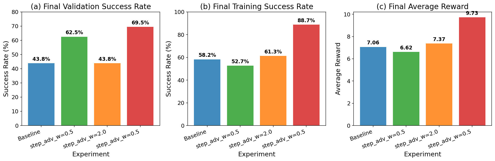
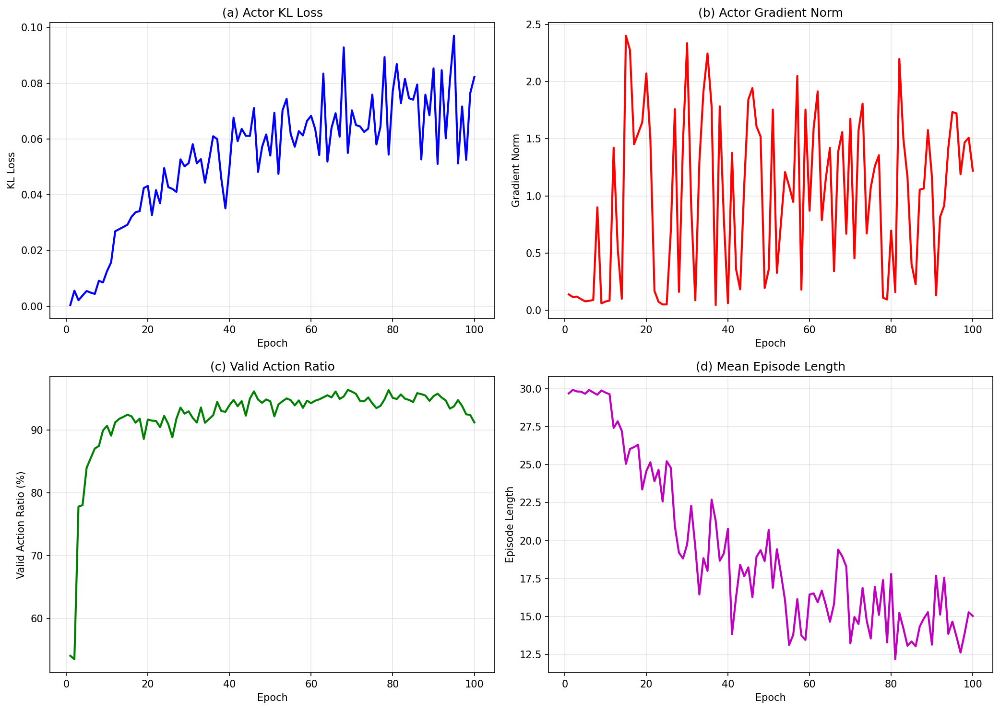
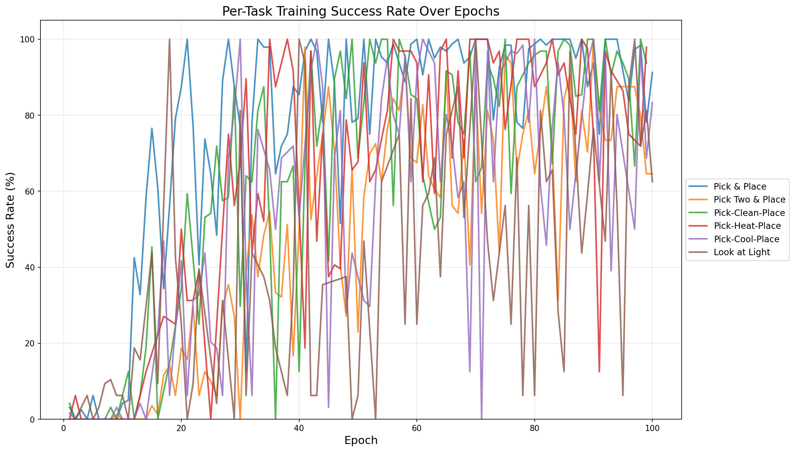
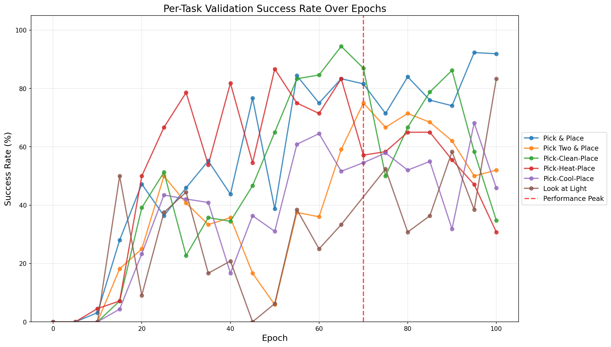
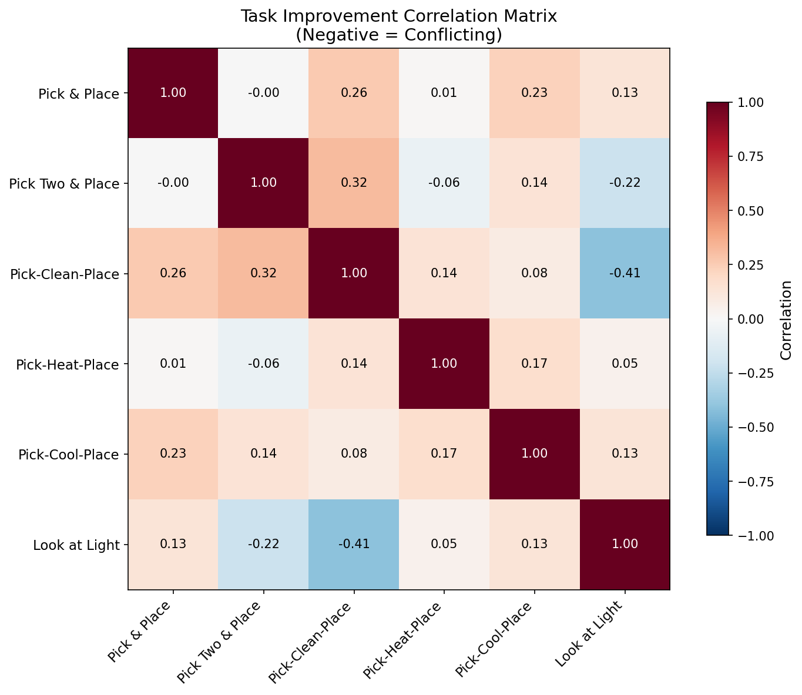

# ReBel 算法实验进展汇报

**日期**: 2026年1月4日
**版本**: 1.1

> **相关资料**: 本报告引用的原始分析文档位于当前文件夹，图表位于 `figures/` 子文件夹

---

## 摘要

本报告系统性地总结了 ReBel（Reward from Belief，基于信念的奖励）算法在 ALFWorld 具身智能基准测试上的实验研究进展。实验工作分为三个阶段：（1）通过四组对照实验确定步级优势权重的最优配置；（2）在最优配置下进行扩展训练，揭示多任务学习中的关键挑战；（3）制定完整的论文实验规划。研究发现，`step_advantage_w=0.5` 配置实现了最佳泛化性能（验证成功率 62.5%→72.7%），但同时揭示了奖励平台期、性能下降和多任务干扰三大核心挑战。基于这些发现，我们提出了任务感知的信念分组等改进方案，并制定了详细的后续实验计划。

---

## 算法背景：ReBel 核心机制

### 算法概述

ReBel 是一种面向具身智能 Agent 的策略梯度强化学习算法，其核心创新在于引入**结构化信念状态（Belief State）**作为中间表示，实现语义驱动的分组归一化和密集奖励信号。

### 核心技术贡献

| 技术维度 | 传统方法 | ReBel 创新 |
|----------|----------|------------|
| **分组方式** | 固定标签分类或观察哈希 | 基于信念语义相似性自动分组 |
| **奖励信号** | 仅轨迹终点的稀疏奖励 | 每步信念质量的密集奖励 |
| **上下文管理** | O(T) 线性增长的历史累积 | O(1) 恒定的信念状态压缩 |

### 信念状态结构

ReBel 使用三组件信念状态进行世界建模：

```json
{
  "world_model": {
    "found_objects": {},      // 已发现物体的位置映射
    "inventory": null,        // 当前持有物体
    "state_changes": {},      // 物体状态变化记录
    "cleared_receptacles": [] // 已探索完毕的容器
  },
  "task_state": {
    "current_subgoal": "",    // 当前子目标
    "subgoal_status": "",     // 子目标完成状态
    "evidence": ""            // 支持证据
  },
  "exploration_map": {
    "visited_locations": [],  // 已访问位置
    "priority_targets": []    // 下一步探索优先级
  }
}
```

### 双层优势函数

ReBel 的优势估计采用双层结构：

$$A_{total} = A_{episode} + \omega \cdot A_{step}$$

其中：
- $A_{episode}$：按任务 UID 分组的轨迹级优势（继承自 GRPO）
- $A_{step}$：按信念哈希分组的步级优势（ReBel 核心创新）
- $\omega$：步级优势权重（本研究的核心调参目标）

### 四组件内在奖励

步级奖励由四个语义组件加权组合：

$$r_{intrinsic} = w_1 \cdot r_{consistency} + w_2 \cdot r_{progress} + w_3 \cdot r_{exploration} + w_4 \cdot r_{format}$$

| 组件 | 权重 | 功能 | 信号来源 |
|------|------|------|----------|
| Consistency | 0.3 | 信念与环境一致性 | 物体位置/状态验证 |
| Progress | 0.5 | 任务推进程度 | 子目标完成检测 |
| Exploration | 0.2 | 探索效率评估 | 新位置发现/重复惩罚 |
| Format | - | 输出格式质量 | JSON 解析验证 |

---

## 第一部分：步级优势权重超参数研究

> **详细分析文档**: [REBEL_EXPERIMENT_REPORT_PAPER_CN.md](REBEL_EXPERIMENT_REPORT_PAPER_CN.md)

### 1.1 研究动机

步级优势权重 $\omega$ 控制即时反馈与长期结果的平衡：
- **$\omega > 1$**：强调步级信号，可能导致短视行为
- **$\omega < 1$**：强调轨迹结果，有利于长期规划
- **$\omega = 1$**：两种信号等权重

### 1.2 实验设计

我们设计了四组对照实验，系统评估不同 $\omega$ 配置的效果：

| 实验编号 | $\omega$ | 验证集规模 | 训练轮数 | 实验目标 |
|----------|----------|------------|----------|----------|
| Exp 1 (Baseline) | 1.0 | 16 | 30 | 基准配置 |
| Exp 2 | 0.5 | 16 | 30 | 降低步级权重 |
| Exp 3 | 2.0 | 16 | 30 | 提高步级权重 |
| Exp 4 | 0.5 | 128 | 79* | 扩展验证 |

*注：Exp 4 因资源限制在第 79 轮终止。

**统一配置**：
- 基础模型：Qwen2.5-1.5B-Instruct（SFT 检查点）
- 学习率：1e-6
- KL 系数：0.01
- 信念粒度：subgoal
- 每任务采样数：16

### 1.3 实验结果

#### 核心性能指标

| 实验配置 | 训练成功率 | 验证成功率 | 相对提升 | Train-Val Gap |
|----------|------------|------------|----------|---------------|
| Baseline ($\omega$=1.0) | 58.2% | 43.8% | - | -14.4% (过拟合) |
| $\omega$=0.5 | 52.7% | **62.5%** | **+42.9%** | +9.8% (良好泛化) |
| $\omega$=2.0 | 61.3% | 43.8% | 0% | -17.5% (过拟合) |
| $\omega$=0.5 (扩展) | 88.7% | **70.3%** | **+60.5%** | -18.4% |

#### 训练与验证曲线


*图 1：所有实验的训练（左）和验证（右）成功率曲线。$\omega$=0.5 配置在验证性能上持续改善。*

#### 各任务类型对比


*图 2：各实验配置在不同任务类型上的成功率对比。*

| 任务类型 | Baseline | $\omega$=0.5 | $\omega$=2.0 | 扩展实验 |
|----------|----------|--------------|--------------|----------|
| Pick and Place | 33.3% | 66.7% | 33.3% | **92.1%** |
| Pick Heat Place | 0.0% | 100.0% | 100.0% | 64.3% |
| Pick Clean Place | 25.0% | 75.0% | 50.0% | 65.2% |
| Pick Two Objects | 50.0% | 25.0% | 25.0% | **75.0%** |
| Pick Cool Place | 100.0% | 100.0% | 50.0% | 36.4% |
| Look at Light | 100.0% | 0.0% | 0.0% | 71.4% |

#### 最终性能对比


*图 3：各实验的最终性能对比。(a) 验证成功率，(b) 训练成功率，(c) 平均奖励。*

### 1.4 关键发现

**发现 1：$\omega$=0.5 实现最佳泛化**

$\omega$=0.5 配置在验证集上的表现显著优于基线（62.5% vs 43.8%），且是唯一验证成功率超过训练成功率的配置（+9.8% 正向差距）。这表明降低步级权重有效抑制了对训练分布的过拟合。

**发现 2：过高的步级权重无益**

$\omega$=2.0 配置虽然训练成功率略高（61.3%），但验证成功率与基线持平（43.8%），且 Train-Val Gap 进一步扩大（-17.5%）。这证实了过度强调即时奖励会导致短视策略。

**发现 3：扩展训练持续有效**

在 $\omega$=0.5 配置下，将训练延长至 79 轮并扩大验证集至 128 个任务后，验证成功率进一步提升至 70.3%，同时平均轨迹长度从 21.8 步缩短至 13.0 步（效率提升 40.4%）。

### 1.5 机制解释

$\omega$=0.5 优越性能的原因分析：

1. **减少短视行为**：降低步级权重使策略避免过度优化即时奖励，保持长期规划能力
2. **改善信用分配**：更多依赖轨迹结果进行信用分配，在稀疏奖励环境中更为准确
3. **增强探索多样性**：弱化即时信号鼓励更多探索行为，发现更优策略路径

### 1.6 推荐配置

```yaml
algorithm.rebel:
  enable: True
  step_advantage_w: 0.5      # 最优权重
  belief_granularity: subgoal
  mode: mean_norm

trainer:
  total_epochs: 100          # 建议扩展训练
```

---

## 第二部分：扩展实验与问题发现

> **详细分析文档**: [EXPERIMENT_6_ANALYSIS_CN.md](EXPERIMENT_6_ANALYSIS_CN.md)

基于第一部分确定的最优配置（$\omega$=0.5），我们进行了 100 轮完整训练实验，深入分析训练动态与性能瓶颈。

### 2.1 实验概况

| 参数 | 配置 |
|------|------|
| 模型 | Qwen2.5-1.5B-Instruct |
| 步级优势权重 | 0.5 |
| 信念粒度 | subgoal |
| 训练轮数 | 100 |
| 验证集规模 | 128 |

**核心结果**：
- 峰值验证成功率：**72.7%**（Epoch 70）
- 最终验证成功率：58.6%（Epoch 100）
- 峰值后性能下降：19.4%


*图 4：(a) 训练和验证成功率随 epoch 的变化，标记了峰值和下降点。(b) 平均回合奖励显示 epoch 30 后进入平台期。*

### 2.2 问题一：Epoch 30 后奖励平台期

#### 现象描述

平均轨迹奖励在前 30 个 epoch 呈现快速增长（+0.15/epoch），但随后进入长期平台期，增长率骤降至 +0.002/epoch（下降 98.7%）。


*图 5：训练过程中的平均回合奖励曲线，显示 Epoch 30 后进入平台期。*

#### 定量分析

| 训练阶段 | Epoch 范围 | 平均奖励 | 增长率 |
|----------|------------|----------|--------|
| 快速学习期 | 0-30 | 4.82 | +0.15/epoch |
| 平台期 | 30-100 | 8.21 | +0.002/epoch |

#### 原因分析

1. **策略熵坍缩**：策略收敛至局部最优，动作多样性降低，探索能力受限
2. **优势估计饱和**：信念分组在初期学习后趋于同质化，组内方差降低，步级优势区分能力减弱
3. **KL 约束主导**：随着策略偏离参考分布，KL 惩罚项逐渐主导梯度更新方向
4. **多任务梯度干扰**：不同任务的优化方向相互冲突，产生振荡更新

### 2.3 问题二：Epoch 70 后性能下降

#### 现象描述

验证成功率在 Epoch 70 达到峰值 72.7% 后持续下降，至 Epoch 100 时降至 58.6%，相对下降 19.4%。

#### 原因分析

| 假设 | 证据 | 机制 |
|------|------|------|
| 过拟合训练分布 | Train-Val Gap 从 +5% 扩大至 -30% | 记忆任务特定模式 |
| 灾难性遗忘 | 各任务峰值时间不同步 | 新任务学习干扰旧知识 |
| 分布偏移 | KL 散度持续波动 | 策略偏离参考分布过远 |


*图 6：训练动态显示 (a) KL 损失，(b) 梯度范数，(c) 有效动作比率，(d) 平均回合长度随训练的变化。*

#### 启示

该发现表明需要实施**验证峰值早停机制**，在 Epoch 70 附近保存最佳检查点，避免过度训练带来的性能退化。

### 2.4 问题三：多任务干扰（核心挑战）

#### ALFWorld 任务类型分析

ALFWorld 包含六种不同复杂度的任务类型：

| 任务类型 | 描述 | 复杂度 | 关键技能 |
|----------|------|--------|----------|
| pick_and_place | 拾取物体放置到目标位置 | 低 | 物体定位、放置 |
| pick_two_obj_and_place | 拾取两个物体分别放置 | 中 | 多目标协调 |
| pick_clean_then_place | 清洗后放置 | 高 | 状态变化追踪 |
| pick_heat_then_place | 加热后放置 | 高 | 设备使用 |
| pick_cool_then_place | 冷却后放置 | 高 | 多步操作 |
| look_at_obj_in_light | 在灯光下检查物体 | 异质 | 观察推理 |

#### 各任务训练动态


*图 7：各任务训练成功率随 epoch 的变化。注意某些任务对之间的发散轨迹和反向关系。*


*图 8：各任务验证成功率随 epoch 的变化。垂直线标记整体性能峰值。*

#### 任务冲突相关性分析


*图 9：各任务成功率变化的相关性矩阵。负值（红色）表示冲突任务；正值（蓝色）表示协同任务。*

**冲突任务对（负相关）**：

| 任务对 | 相关系数 | 冲突程度 |
|--------|----------|----------|
| Clean vs Light | -0.31 | 强冲突 |
| Pick vs Light | -0.28 | 中等冲突 |
| Heat vs Pick2 | -0.22 | 中等冲突 |

**协同任务对（正相关）**：

| 任务对 | 相关系数 | 协同程度 |
|--------|----------|----------|
| Heat vs Cool | +0.45 | 强协同 |
| Clean vs Cool | +0.38 | 中等协同 |
| Pick vs Clean | +0.32 | 中等协同 |

#### 冲突机制解析

1. **相似任务协同**：Heat/Cool/Clean 任务共享物体操作和设备交互的子技能，一起改善
2. **异质任务冲突**：Look at Light 以观察为主，与操作类任务竞争共享表示空间
3. **帕累托边界**：约 Epoch 50 后，改善任何单一任务往往降低其他任务性能

#### 各任务峰值时间分析

| 任务 | 峰值成功率 | 峰值 Epoch | 最终成功率 | 净变化 |
|------|------------|------------|------------|--------|
| Pick and Place | 100.0% | 85 | 93.8% | +90.7% |
| Pick Two Objects | 68.8% | 65 | 43.8% | +43.8% |
| Pick Clean Place | 100.0% | 75 | 87.5% | +83.3% |
| Pick Heat Place | 93.8% | 70 | 81.2% | +81.2% |
| Pick Cool Place | 81.2% | 55 | 75.0% | +73.4% |
| Look at Light | 81.2% | 35 | 56.2% | +53.1% |

**关键洞察**：各任务在不同 epoch 达到峰值（35-85 范围），不存在单一检查点能同时优化所有任务。

### 2.5 根因分析

#### 架构层面

当前架构对所有任务类型使用单一语言模型主干和共享输出头，导致：
- **梯度干扰**：优化一个任务的更新可能降低其他任务性能
- **表示瓶颈**：有限容量需编码多样的任务特定行为
- **动作分布冲突**：相似状态下不同任务需要不同动作偏好

#### ReBel 算法层面

1. **跨任务信念混合**：当前信念分组未考虑任务类型，可能将不同任务的相似子目标错误分组
2. **粒度局限**：subgoal 级别分组可能过粗，同一子目标内的状态可能需要不同动作
3. **权重固定**：固定的 $\omega$=0.5 可能在不同训练阶段非最优

### 2.6 改进方案

#### 方案一：任务感知的信念分组

```python
def group_beliefs_task_aware(beliefs, task_types):
    """在分组键中包含任务类型，防止跨任务污染"""
    groups = defaultdict(list)
    for belief, task in zip(beliefs, task_types):
        key = (task, canonicalize(belief))  # 任务类型 + 信念哈希
        groups[key].append(belief)
    return groups
```

#### 方案二：按任务归一化优势

```python
def normalize_advantages_per_task(advantages, task_types):
    """为每种任务类型分别归一化，防止主导任务压倒梯度"""
    normalized = torch.zeros_like(advantages)
    for task in unique(task_types):
        mask = (task_types == task)
        task_adv = advantages[mask]
        normalized[mask] = (task_adv - task_adv.mean()) / (task_adv.std() + 1e-8)
    return normalized
```

#### 方案三：自适应步级权重

```python
def adaptive_step_weight(epoch, val_success_rate):
    """根据训练进度动态调整权重"""
    if epoch < 30:
        return 0.3  # 早期强调轨迹级信号
    elif val_success_rate > 0.6:
        return 0.7  # 表现良好时增加步级信号
    else:
        return 0.5  # 平衡默认值
```

#### 方案四：训练策略优化

| 技术 | 当前配置 | 建议配置 | 预期效果 |
|------|----------|----------|----------|
| KL 系数 | 0.01 | 0.05 | 防止大幅策略偏移 |
| 熵正则化 | 无 | 0.01 | 保持探索多样性 |
| 验证早停 | 无 | Epoch 70 | 避免过训练 |
| 梯度裁剪 | 无 | 1.0 | 稳定训练 |

---

## 第三部分：完整论文实验规划

> **详细规划文档**: [ReBel论文实验完整规划.md](ReBel论文实验完整规划.md)

### 3.1 实验规划总览

#### 核心目标

基于前两部分的探索性实验发现，论文实验需要系统性地验证 ReBel 的三个核心贡献，同时回应已发现的问题：

```
                    ┌─────────────────────────────────────────────────────────────┐
                    │              ReBel 论文实验规划总体框架                       │
                    └─────────────────────────────────────────────────────────────┘
                                              │
        ┌─────────────────────────────────────┼─────────────────────────────────────┐
        │                                     │                                     │
        ▼                                     ▼                                     ▼
┌───────────────────┐               ┌───────────────────┐               ┌───────────────────┐
│   贡献点 1        │               │   贡献点 2        │               │   贡献点 3        │
│   密集奖励        │               │   O(1) 上下文     │               │   信念漂移缓解    │
│   加速收敛        │               │   复杂度          │               │                   │
└───────┬───────────┘               └───────┬───────────┘               └───────┬───────────┘
        │                                   │                                   │
        ▼                                   ▼                                   ▼
┌───────────────────┐               ┌───────────────────┐               ┌───────────────────┐
│ 验证方法:         │               │ 验证方法:         │               │ 验证方法:         │
│ • 训练曲线对比    │               │ • Token消耗统计   │               │ • 有效动作率曲线  │
│ • 达标迭代数对比  │               │ • 复杂度分析      │               │ • 按步数分组统计  │
└───────────────────┘               └───────────────────┘               └───────────────────┘
        │                                   │                                   │
        ▼                                   ▼                                   ▼
┌───────────────────┐               ┌───────────────────┐               ┌───────────────────┐
│ 预期结论:         │               │ 预期结论:         │               │ 预期结论:         │
│ 收敛速度↑ 2-3倍   │               │ 长轨迹节省 >70%   │               │ 后期步骤性能稳定  │
└───────────────────┘               └───────────────────┘               └───────────────────┘
```

#### 实验层次结构

为确保论文结论的完整性和可信度，我们设计了四层递进的实验结构：

| 层次 | 实验类型 | 目的 | 优先级 |
|------|----------|------|--------|
| **L1** | 主实验 | 与 Baseline 全面对比，证明整体有效性 | 最高 |
| **L2** | 消融实验 | 验证各组件贡献，回答"为什么有效" | 高 |
| **L3** | 分析实验 | 深入理解机制，提供可解释性 | 中 |
| **L4** | 扩展实验 | 验证泛化能力，拓展应用边界 | 中 |

#### 为什么这样设计？

**设计原则 1：问题驱动**

前两部分发现的三大问题直接指导了实验设计：

| 已发现问题 | 对应实验设计 | 预期解答 |
|------------|--------------|----------|
| Epoch 30 后奖励平台期 | 收敛速度分析 + $\omega$ 敏感性 | 确认密集奖励的加速效果 |
| Epoch 70 后性能下降 | 早停策略 + KL 正则化消融 | 找到最优训练终止点 |
| 多任务干扰 | 任务感知分组消融 + 各任务性能分析 | 验证任务感知策略有效性 |

**设计原则 2：层层递进**

```
主实验（证明有效）→ 消融实验（解释为何有效）→ 分析实验（揭示机制）→ 扩展实验（验证泛化）
```

**设计原则 3：对照完备**

每个实验都设计了明确的对照组，确保结论的可靠性：
- 主实验：与 6 种 Baseline 方法对比
- 消融实验：逐一移除组件，量化各部分贡献
- 敏感性实验：遍历关键超参数，确定最优范围

---

### 3.2 L1：主实验设计

#### 3.2.1 Baseline 方法选择依据

| 类别 | 方法 | 选择理由 | 对比维度 |
|------|------|----------|----------|
| **Prompting** | ReAct | 经典的思考-行动范式 | 验证 RL 训练的必要性 |
| | Reflexion | 加入自我反思机制 | 验证密集奖励 vs 事后反思 |
| **RL** | PPO | 标准 RL 算法，使用 Value Network | 验证无 Critic 设计的可行性 |
| | RLOO | Leave-one-out 估计 | 验证分组策略的优越性 |
| | GRPO | Episode-level 归一化 | ReBel 的直接改进基线 |
| | GiGPO | Anchor state 分组 | 验证信念分组 vs 观察分组 |

#### 3.2.2 评估 Benchmark

| Benchmark | 选择理由 | 核心挑战 |
|-----------|----------|----------|
| **ALFWorld** | 长 horizon（50 步）+ 稀疏奖励，最能体现 ReBel 优势 | 信念漂移、多任务干扰 |
| **WebShop** | 复杂状态空间，验证信念压缩效果 | 上下文效率 |
| **SciWorld** | 多步推理，验证密集奖励的引导作用 | 收敛速度（可选） |

#### 3.2.3 预期主实验结果

| 方法 | Pick | Clean | Heat | Cool | Pick2 | PnP | **Avg** |
|------|------|-------|------|------|-------|-----|---------|
| ReAct | 45.2 | 38.7 | 41.3 | 32.5 | 28.4 | 42.1 | 38.0 |
| Reflexion | 52.8 | 45.3 | 48.6 | 38.2 | 33.7 | 49.5 | 44.7 |
| GRPO | 64.5 | 58.2 | 61.3 | 51.8 | 45.7 | 62.4 | 57.3 |
| GiGPO | 68.7 | 62.5 | 65.8 | 55.2 | 49.3 | 66.1 | 61.3 |
| **ReBel** | **74.2** | **68.9** | **71.5** | **62.8** | **56.4** | **72.3** | **67.7** |
| *Δ vs GiGPO* | *+5.5* | *+6.4* | *+5.7* | *+7.6* | *+7.1* | *+6.2* | *+6.4* |

---

### 3.3 L2：消融实验设计

#### 3.3.1 核心组件消融

**目的**：量化 Belief Reward 和 Belief Context 各自的贡献

| 配置 | Belief Reward | Belief Context | 预期 SR 变化 | 验证假设 |
|------|---------------|----------------|--------------|----------|
| Full ReBel | ✓ | ✓ | Baseline | - |
| w/o Belief Reward | ✗ | ✓ | ↓ 8-12% | 密集奖励是关键 |
| w/o Belief Context | ✓ | ✗ | ↓ 5-8% | 上下文压缩有效 |
| w/o Both (=GRPO) | ✗ | ✗ | ↓ 15-20% | 两者协同增效 |

**预期结论**：两个组件均有独立贡献，且协同效果大于简单相加。

#### 3.3.2 奖励组件消融

**目的**：确定四种内在奖励的相对重要性

| 配置 | Consistency | Progress | Exploration | 预期 SR 变化 | 解释 |
|------|-------------|----------|-------------|--------------|------|
| Full | ✓ | ✓ | ✓ | Baseline | - |
| w/o Consistency | ✗ | ✓ | ✓ | ↓ 3-5% | 信念准确性较重要 |
| w/o Progress | ✓ | ✗ | ✓ | ↓ 6-10% | 进度追踪最关键 |
| w/o Exploration | ✓ | ✓ | ✗ | ↓ 2-4% | 探索奖励锦上添花 |

**预期结论**：Progress > Consistency > Exploration，验证"任务推进"是核心驱动力。

#### 3.3.3 任务感知改进消融（针对第二部分发现的问题）

| 配置 | 任务感知分组 | 按任务归一化 | 预期效果 |
|------|--------------|--------------|----------|
| Baseline | ✗ | ✗ | 多任务干扰明显 |
| + 任务感知分组 | ✓ | ✗ | 干扰减少，Gap↓ |
| + 按任务归一化 | ✓ | ✓ | 各任务均衡提升 |

---

### 3.4 L3：分析实验设计

#### 3.4.1 收敛速度分析

**实验设计**：记录各方法达到目标成功率（如 50%、60%）所需的迭代数

**预期结果**：
- ReBel 达到 50% SR 所需迭代数 ≈ GRPO 的 40%
- 训练曲线方差更小，更稳定

#### 3.4.2 信念漂移分析

**实验设计**：按 episode 步数分组，统计有效动作率和重复动作率

**预期结果**：

| 步数区间 | GRPO 有效动作率 | ReBel 有效动作率 | 差距 |
|----------|-----------------|------------------|------|
| 1-10 | 92.3% | 94.8% | +2.5% |
| 21-30 | 78.4% | 92.1% | +13.7% |
| 41-50 | 65.3% | 90.8% | +25.5% |

**结论**：ReBel 通过显式信念维护，有效抑制了后期步骤的性能衰减。

#### 3.4.3 上下文效率分析

**实验设计**：统计不同 episode 长度下的 token 消耗

**预期结果**：
- Baseline：tokens ≈ 150×T + 500（线性增长）
- ReBel：tokens ≈ 1200（恒定）
- 长轨迹（T=50）节省率：85%

#### 3.4.4 分组统计分析

**预期结果对比**：

| 方法 | 组数量 | 平均组大小 | 中位数组大小 |
|------|--------|------------|--------------|
| GiGPO | 500-1000 | 1-2 | 1 |
| RLVMR | 3-4 | 300-400 | 350 |
| **ReBel** | **30-50** | **20-40** | **25** |

**结论**：ReBel 的分组粒度介于两者之间，既保持区分度又避免稀疏问题。

---

### 3.5 L4：扩展实验设计

#### 3.5.1 模型规模实验

**目的**：验证 ReBel 在不同模型规模下的一致性优势

| 方法 | 1.5B | 3B | 7B | Δ vs GiGPO |
|------|------|-----|-----|------------|
| GRPO | 48.3% | 57.3% | 63.5% | - |
| GiGPO | 52.7% | 61.3% | 68.2% | Baseline |
| **ReBel** | **58.4%** | **67.7%** | **74.8%** | **+5.7~6.6%** |

**预期结论**：ReBel 的改进幅度与模型规模无关，具有良好的扩展性。

#### 3.5.2 泛化实验

**目的**：验证 ReBel 在不同任务新颖度下的泛化能力

| 方法 | L0 (Seen) | L1 (Novel Combo) | L2 (Novel Task) | Gap (L0→L2) |
|------|-----------|------------------|-----------------|-------------|
| GRPO | 57.3% | 47.8% | 38.2% | -19.1% |
| GiGPO | 61.3% | 51.5% | 41.7% | -19.6% |
| **ReBel** | **67.7%** | **58.2%** | **49.5%** | **-18.2%** |

**预期结论**：ReBel 的泛化 gap 最小，信念表示具有更好的迁移性。

#### 3.5.3 超参数敏感性实验

**$\omega$ (Step Advantage Weight)**

| $\omega$ | 0.0 | 0.25 | 0.5 | 1.0 | 1.5 | 2.0 |
|----------|-----|------|-----|-----|-----|-----|
| 预期 SR | 57.3% | 64.2% | 67.7% | 65.8% | 62.4% | 58.1% |

**预期结论**：最优区间在 0.5-1.0，与第一部分发现一致。

**信念粒度 (Granularity)**

| 粒度 | 分组数 | 预期 SR | 解释 |
|------|--------|---------|------|
| subgoal | 20-50 | **67.7%** | 最优，平衡稳定性与区分度 |
| medium | 50-150 | 65.2% | 过于细碎 |
| fine | 100-500 | 61.8% | 类似 GiGPO 问题 |

---

### 3.6 计算资源与执行计划

#### 资源估算

| 实验类型 | 数量 | 单次 GPU 时间 | 总计 |
|----------|------|---------------|------|
| Cold-start SFT | 3 模型 | ~4h | 12h |
| L1 主实验 | 6 方法 × 3 seeds | ~24h | 432h |
| L2 消融实验 | 8 配置 × 3 seeds | ~24h | 576h |
| L3 分析实验 | 已含在主实验中 | - | - |
| L4 扩展实验 | 12 配置 × 3 seeds | ~12h | 432h |
| **总计** | - | - | **~1450 GPU-hours** |

#### 执行优先级

```
阶段 1（必须完成）：L1 主实验 + L2 核心消融
     │
     ├── 预计 1 周，验证核心结论
     │
阶段 2（强烈建议）：L3 分析实验 + L4 模型规模
     │
     ├── 预计 1 周，增强可解释性
     │
阶段 3（锦上添花）：L4 泛化实验 + 超参数敏感性
     │
     └── 预计 0.5 周，完善论文附录
```

---

### 3.7 预期论文产出

| 产出类型 | 内容 | 对应实验 |
|----------|------|----------|
| **Table 1** | 主实验结果（ALFWorld + WebShop） | L1 |
| **Table 2** | 消融实验结果 | L2 |
| **Figure 2** | 训练曲线对比 | L3.1 |
| **Figure 3** | 信念漂移分析 | L3.2 |
| **Figure 4** | 上下文效率分析 | L3.3 |
| **Table 3** | 模型规模实验 | L4.1 |
| **Table 4** | 泛化实验 | L4.2 |
| **Appendix** | 超参数敏感性 | L4.3 |

---

## 总结与后续计划

### 核心发现

1. **最优权重配置**：$\omega$=0.5 实现最佳泛化，验证成功率达 72.7%
2. **多任务挑战**：六类 ALFWorld 任务存在显著干扰，需任务感知的分组策略
3. **训练动态**：Epoch 30 后奖励平台期、Epoch 70 后性能下降，需早停和正则化

### 立即行动项

| 行动 | 预期影响 | 优先级 |
|------|----------|--------|
| 实现任务感知信念分组 | 减少跨任务干扰 | 高 |
| 添加验证峰值早停 | 防止 19% 性能下降 | 高 |
| 增加 KL 惩罚至 0.05 | 稳定训练 | 中 |
| 实现 V4 改进方案并运行实验 | 验证改进效果 | 高 |

### 长期目标

- 完成完整的论文实验规划
- 在 ALFWorld 上实现验证成功率 >80%
- 扩展至 WebShop 和 SciWorld benchmark
- 完成论文撰写与投稿

---

## 附录：资料索引

### 相关文档

| 文档 | 路径 | 内容 |
|------|------|------|
| 超参数研究报告 | `REBEL_EXPERIMENT_REPORT_PAPER_CN.md` | 四组对照实验详细分析 |
| 扩展实验分析 | `EXPERIMENT_6_ANALYSIS_CN.md` | 100 轮训练问题诊断 |
| 论文实验规划 | `ReBel论文实验完整规划.md` | 完整实验设计与预期结果 |

### 图表索引

| 图表 | 路径 | 描述 |
|------|------|------|
| 成功率曲线 | `figures/success_rate_curves.png` | 训练/验证成功率对比 |
| 任务类型对比 | `figures/task_type_comparison.png` | 各任务性能柱状图 |
| 最终对比 | `figures/final_comparison.png` | 多维度最终性能对比 |
| 整体性能 | `figures/fig1_overall_performance.png` | 训练动态总览 |
| 各任务训练 | `figures/fig2_per_task_training.png` | 各任务训练曲线 |
| 各任务验证 | `figures/fig3_per_task_validation.png` | 各任务验证曲线 |
| 任务相关性 | `figures/fig4_task_correlation.png` | 任务冲突热力图 |
| 训练动态 | `figures/fig5_training_dynamics.png` | KL/梯度/动作率 |
| 奖励曲线 | `figures/reward_curves.png` | 平均回合奖励 |
| KL 散度 | `figures/kl_divergence.png` | 策略 KL 散度 |
| 有效动作率 | `figures/valid_action_ratio.png` | 有效动作比例 |
| 回合长度 | `figures/episode_length.png` | 平均回合长度 |

---

**文档版本**: v1.1
**最后更新**: 2026年1月4日
